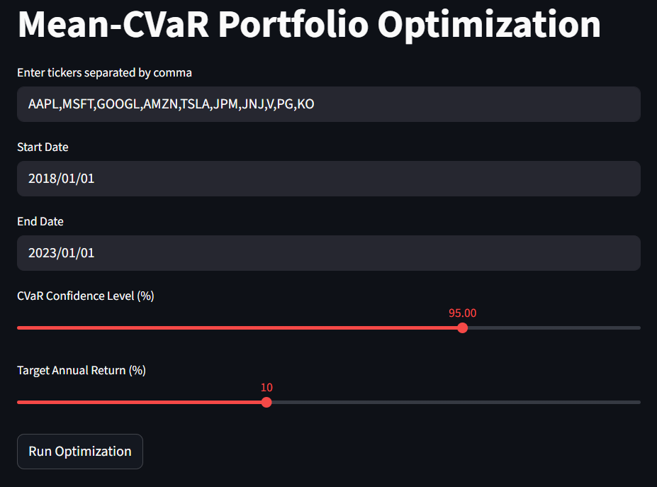
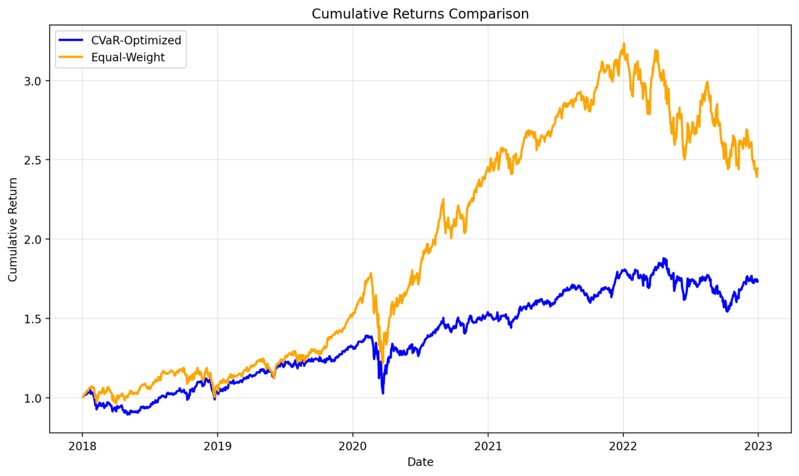
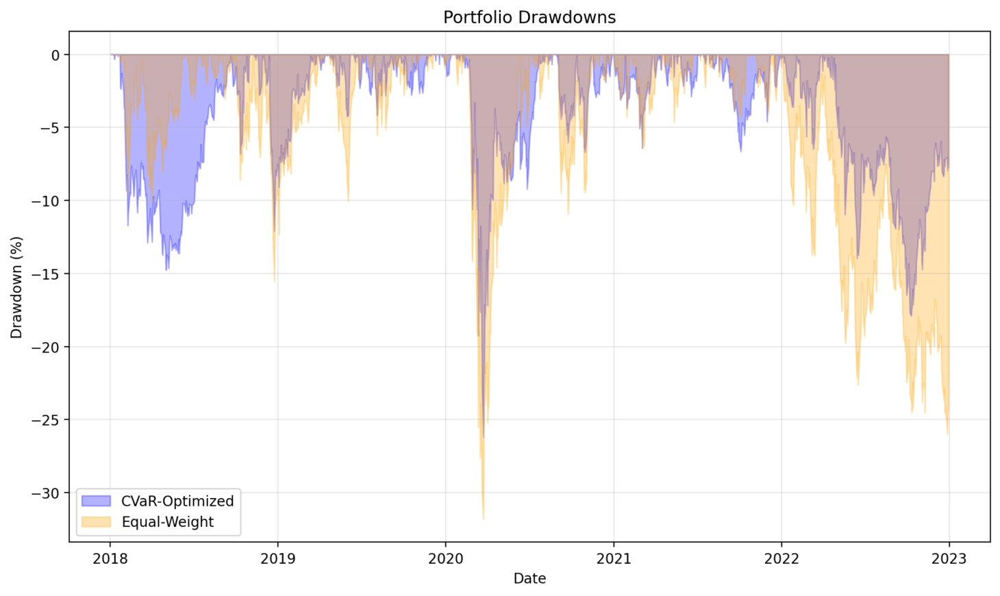

# Mean-CVaR Portfolio Optimization

A comprehensive portfolio optimization tool that uses **Conditional Value at Risk (CVaR)** to construct optimal portfolios that minimize tail risk while meeting return targets. Unlike traditional mean-variance optimization, CVaR focuses on minimizing expected losses in worst-case scenarios through a **convex optimization framework** that guarantees globally optimal solutions, making it particularly valuable for risk-conscious investors.

Built with Streamlit for interactive web-based analysis.

## Mathematical Model

The optimization solves the following convex problem:

**Objective Function:**
$\text{minimize} \quad \text{CVaR}_\alpha = \nu + \frac{1}{1-\alpha} \cdot \frac{1}{T} \sum_{t=1}^{T} \xi_t$

**Subject to:**
$\begin{align}
\sum_{i=1}^{n} w_i &= 1 && \text{(budget constraint)} \\
w_i &\geq 0 && \text{(long-only positions)} \\
\xi_t &\geq -\mathbf{r}_t^T \mathbf{w} - \nu && \text{(CVaR auxiliary variables)} \\
\boldsymbol{\mu}^T \mathbf{w} &\geq r_{\text{target}} && \text{(minimum return constraint)}
\end{align}$

**Decision Variables:**
- $\mathbf{w} \in \mathbb{R}^n$ = portfolio weights vector
- $\nu \in \mathbb{R}$ = Value at Risk (VaR) threshold
- $\boldsymbol{\xi} \in \mathbb{R}^T_+$ = excess losses beyond VaR

**Parameters:**
- $\alpha \in (0,1)$ = confidence level (e.g., 0.95 for 95%)
- $\mathbf{r}_t \in \mathbb{R}^n$ = asset returns vector at time $t$
- $\boldsymbol{\mu} \in \mathbb{R}^n$ = expected returns vector
- $r_{\text{target}} \in \mathbb{R}$ = minimum acceptable return
- $T$ = number of historical scenarios
- $n$ = number of assets

## Interface Preview

### Main Interface


### Cumulative Returns Comparison


### Drawdown Comparison


## Features

- **Interactive Portfolio Optimization**: Web-based interface for real-time portfolio construction
- **CVaR Risk Management**: Minimize expected losses at specified confidence levels (85%-99%)
- **Flexible Asset Selection**: Support for any stock tickers available on Yahoo Finance
- **Performance Comparison**: Side-by-side analysis with equal-weight benchmarks
- **Comprehensive Visualizations**:
  - Portfolio weight allocations
  - Cumulative return comparisons
  - Drawdown analysis
- **Risk-Return Trade-offs**: Adjustable minimum return targets and confidence levels


## Installation

### Prerequisites

**Python Version:** Python 3.10 is recommended for optimal performance and compatibility.

```bash
pip install -r requirements.txt
```

### Required Packages

| Package | Purpose |
|---------|---------|
| `cvxpy` | Convex optimization solver |
| `matplotlib` | Plotting and visualization |
| `numpy` | Numerical computations |
| `pandas` | Data manipulation |
| `streamlit` | Web application framework |
| `yfinance` | Financial data download |

## Usage

### Running the Application

```bash
streamlit run app.py
```

The application will open in your default web browser at `http://localhost:8501`.

### Configuration Options

1. **Asset Selection**: Enter stock tickers separated by commas
   - Default: `AAPL,MSFT,GOOGL,AMZN,TSLA,JPM,JNJ,V,PG,KO`
   - Supports any Yahoo Finance ticker symbols

2. **Time Period**: Select start and end dates for historical data
   - Default: January 1, 2018 to January 1, 2023

3. **Risk Parameters**:
   - **CVaR Confidence Level**: 85%-99% (default: 95%)
   - **Target Annual Return**: 0%-25% (default: 10%)

### Interpreting Results

#### Portfolio Weights
- Shows optimal allocation percentages for each asset
- Weights sum to 100% (fully invested)
- Zero weights indicate assets excluded from optimal portfolio

#### Performance Metrics
- **CVaR Value**: Expected loss in worst-case scenarios (at selected confidence level)
- **Expected Annual Return**: Projected portfolio return (annualized)
- **Risk Metrics Table**: Comprehensive comparison including volatility and drawdowns
- **Optimization Status**: Confirms successful solution

#### Comparative Analysis
- **Cumulative Returns**: CVaR-optimized vs. equal-weight benchmark
- **Drawdown Analysis**: Maximum peak-to-trough losses over time

## Key Benefits

### Risk Management
- **Tail Risk Focus**: Explicitly minimizes extreme downside scenarios
- **Coherent Risk Measure**: CVaR satisfies all coherency axioms
- **Customizable Confidence**: Adjust risk tolerance from conservative (99%) to moderate (85%)

### Portfolio Construction
- **Return Targeting**: Specify minimum acceptable returns
- **Long-Only Constraints**: Practical implementation without short selling
- **Diversification**: Automatic asset selection based on risk-return profiles

### Performance Analysis
- **Benchmark Comparison**: Evaluate against naive diversification
- **Drawdown Control**: Monitor and minimize sustained losses
- **Visual Analytics**: Clear charts for decision-making

## Technical Details

### Optimization Solver
- Uses **CVXPY** with **SCS** solver for robust convex optimization
- Handles portfolios with hundreds of assets efficiently
- Automatic constraint validation and feasibility checking

### Data Processing
- **Yahoo Finance Integration**: Automatic price data download
- **Return Calculation**: Adjusted close prices with dividend reinvestment
- **Dynamic Annualization**: Automatically adapts to actual data period length

### Risk Calculations
- **Historical Simulation**: Uses empirical return distribution
- **VaR Estimation**: Implicit calculation through CVaR optimization
- **Drawdown Metrics**: Peak-to-trough analysis for downside risk
- **Dynamic Scaling**: All metrics automatically adjust to data period length

## Customization

### Adjusting Risk Parameters
Modify the slider ranges for different use cases:

```python
# For institutional investors (higher risk tolerance)
alpha = st.slider("CVaR Confidence Level (%)", 90.0, 99.9, 97.5, 0.1) / 100

# For conservative investors (lower return targets)
target_return_annual = st.slider("Target Annual Return (%)", 0, 15, 5, 1) / 100
```

### Alternative Constraints
Add sector constraints, maximum position limits, or ESG filters:

```python
# Example: Maximum 20% allocation per asset
constraints.append(w <= 0.20)

# Example: Minimum allocation for selected assets
constraints.append(w[selected_indices] >= 0.05)
```

## License

This project is open-source and available under the MIT License.